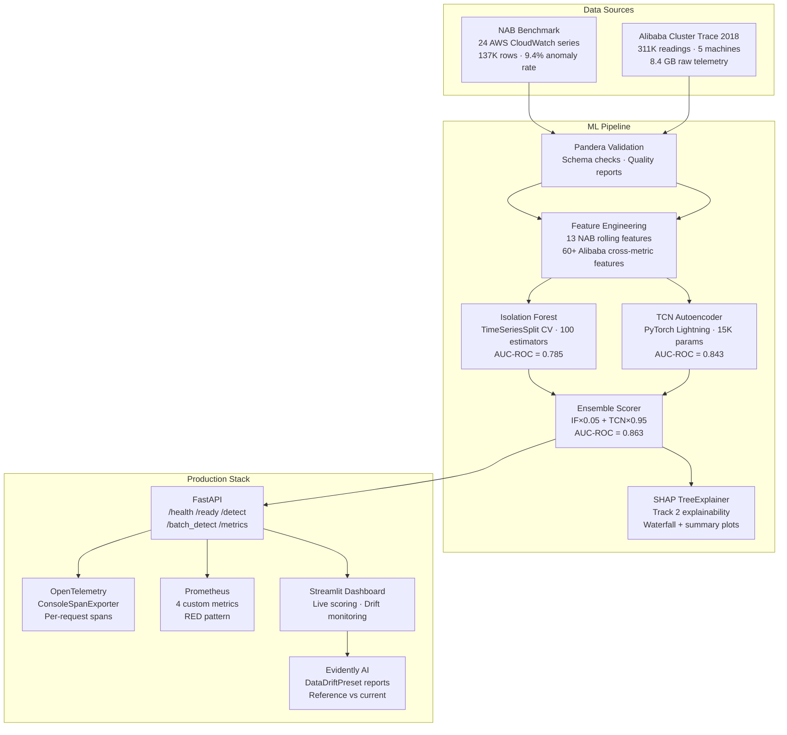

cat > README.md << 'READMEEOF'
# CloudDrift — Cloud Infrastructure Anomaly Detector
 
[](https://github.com/howlingwolf77/clouddrift/actions/workflows/ci.yml)
[](https://www.python.org/downloads/)
[](https://docs.astral.sh/uv/)
[](https://fastapi.tiangolo.com)
[](LICENSE)
 
> ML-powered detection of cloud infrastructure drift before it becomes
> an outage. Combines an Isolation Forest and a TCN Autoencoder in a
> weighted ensemble (val AUC-ROC = **0.863**) with lightweight
> z-score attribution for real-time anomaly explanations.
 
---
 
## Results
 
| Model | Val AUC-ROC | Test AUC-ROC | Architecture |
|-------|-------------|--------------|--------------|
| Isolation Forest | 0.785 | 0.439 | 100 trees, 13 rolling features |
| TCN Autoencoder | 0.843 | 0.519 | 4-level dilated causal, seq=30 |
| **Ensemble (IF=0.05, TCN=0.95)** | **0.863** | 0.435 | Two-stage weight scan |
 
The ensemble beats both individual models on the validation set,
confirming genuine complementary signal between point-wise feature-
space isolation (IF) and temporal sequence reconstruction (TCN).
 
> **Note on test AUC-ROC:** test-set performance degrades relative to
> validation due to temporal non-stationarity in the NAB benchmark —
> the test period (Jul–Jan 2015) contains anomaly signatures not
> represented in the training period (Jan–Jul 2014). This is a known
> property of single-split evaluation on heterogeneous real-world
> time-series, not a model defect. See `MODEL_CARD.md` for full
> discussion.
 
---
 
## Architecture
 

 
---
 
## Quick Start
 
### Prerequisites
 
```bash
git clone https://github.com/howlingwolf77/clouddrift.git
cd clouddrift
```
 
You will need the model artifacts (`isolation_forest.joblib`,
`tcn_autoencoder.pt`, etc.) in `artifacts/`. These are not committed
to the repo (too large). Contact the author or run the Day 4–6
training pipelines to generate them.
 
### Local development
 
```bash
# Install dependencies
uv sync
 
# Start the FastAPI service
uv run uvicorn api.main:app --reload --port 8000
 
# In a second terminal: start the Streamlit dashboard
uv run streamlit run dashboard/app.py
```
 
- API: http://localhost:8000/docs
- Dashboard: http://localhost:8501
- Metrics: http://localhost:8000/metrics
 
### Docker Compose (recommended)
 
```bash
docker compose up --build
```
 
Both services start automatically. The dashboard waits for the API
health check to pass before accepting traffic.
 
- API: http://localhost:8000/docs
- Dashboard: http://localhost:8501
 
### With Prometheus monitoring
 
```bash
docker compose --profile monitoring up --build
```
 
- Prometheus: http://localhost:9090
 
---
 
## API Reference
 
| Method | Endpoint | Description |
|--------|----------|-------------|
| GET | `/health` | Liveness — always 200 if process is running |
| GET | `/ready` | Readiness — 503 until all artifacts loaded |
| POST | `/detect` | Single-snapshot anomaly detection |
| POST | `/batch_detect` | Batch scoring, ranked by anomaly score |
| GET | `/metrics` | Prometheus scrape endpoint |
 
**Example: detect an anomaly**
 
```bash
curl -X POST http://localhost:8000/detect \
  -H "Content-Type: application/json" \
  -d '{
    "cpu_util": 99.0,
    "mem_util": 98.0,
    "net_io_in": 95.0,
    "net_io_out": 90.0,
    "timestamp": "2026-07-04T14:30:00Z"
  }'
```
 
Response:
```json
{
  "anomaly_score": 0.9312,
  "severity_label": "Critical",
  "top_contributing_features": ["cpu_util", "mem_util", "net_io_in"],
  "feature_deviation_scores": {"cpu_util": 2.95, "mem_util": 1.90, "net_io_in": 3.47},
  "inference_latency_ms": 4.7,
  "detection_mode": "single_point_zscore"
}
```
 
---
 
## Datasets
 
| Dataset | Source | Role | Size |
|---------|--------|------|------|
| Numenta Anomaly Benchmark (NAB) | [numenta/NAB](https://github.com/numenta/NAB) | Model training and evaluation | 137K rows, 24 series |
| Alibaba Cluster Trace 2018 | [alibaba/clusterdata](https://github.com/alibaba/clusterdata) | Feature engineering and API reference stats | 311K rows, 8.4 GB raw |
 
NAB provides verified ground-truth anomaly labels — required for
model evaluation. Alibaba provides real production multi-metric
telemetry matching the API's input schema — the kind of data CloudDrift
is designed to run against in production.
 
---
 
## Tech Stack
 
| Layer | Technology | Version |
|-------|-----------|---------|
| Package manager | uv | 0.5.26 |
| Language | Python | 3.13 |
| Data validation | Pandera | 0.32 |
| ML — baseline | scikit-learn IsolationForest | 1.9 |
| ML — deep learning | PyTorch + Lightning | 2.12 + 2.x |
| Explainability | SHAP TreeExplainer | 0.52 |
| API framework | FastAPI + Pydantic v2 | 0.136 + 2.x |
| Tracing | OpenTelemetry | 1.20 |
| Metrics | prometheus-client | 0.20 |
| Dashboard | Streamlit | 1.28 |
| Drift monitoring | Evidently AI | 0.7 |
| Containers | Docker Compose v2 | v2.x |
| CI/CD | GitHub Actions | — |
| Linting | Ruff | 0.1.6 |
 
---
 
## Explainability
 
CloudDrift uses a two-track explainability design:
 
**Track 1 — Production API (z-score attribution)**
Every `/detect` response includes `top_contributing_features` and
`feature_deviation_scores`: the metrics that deviated most from their
training normal distribution, computed in microseconds with no
additional model inference. See `api/services/detection.py`.
 
**Track 2 — Evaluation notebook (SHAP)**
`notebooks/06_shap_analysis.ipynb` runs `shap.TreeExplainer` on the
Isolation Forest and produces waterfall charts for the top 5
ensemble-flagged anomaly windows. This provides the mathematically
exact Shapley value decomposition used to validate that Track 1's
lightweight heuristic is trustworthy. See `docs/MONITORING_GUIDE.md`.
 
---
 
## Limitations
 
- **Validation vs test AUC-ROC gap:** The ensemble achieves 0.863 on
  validation but ~0.43 on test due to temporal non-stationarity in
  the NAB benchmark. See `MODEL_CARD.md` and `docs/adr/ADR-001-isolation-forest.md`.
- **Single-point detection mode:** `/detect` uses z-score attribution,
  not the full IF+TCN ensemble. The ensemble requires rolling window
  context (≥30 timesteps) not available from a single snapshot. See
  `docs/ADR-003-fastapi.md`.
- **Retraining:** The current models were trained on NAB data from
  2014–2015. Production use requires periodic retraining on recent
  telemetry. See `docs/MONITORING_GUIDE.md`.
 
---
 
## Project Structure
 
````
clouddrift/
├── src/
│   ├── data/          # ingestion.py, validation.py
│   ├── features/      # engineering.py
│   └── models/        # isolation_forest.py, tcn_autoencoder.py,
│                      # ensemble.py
├── api/
│   ├── main.py        # FastAPI app, lifespan, /metrics
│   ├── routers/       # health.py, detection.py
│   ├── schemas/       # telemetry.py (Pydantic v2)
│   └── services/      # detection.py, metrics.py, observability.py
├── dashboard/
│   ├── app.py         # Streamlit dashboard
│   └── drift_monitor.py  # Evidently AI integration
├── notebooks/
│   └── 06_shap_analysis.ipynb  # Track 2 SHAP explainability
├── docs/
│   ├── adr/           # 6 Architecture Decision Records
│   ├── API_DOCUMENTATION.md
│   ├── MONITORING_GUIDE.md
│   └── DEPLOYMENT_GUIDE.md
├── monitoring/
│   └── prometheus.yml
├── tests/             # 296 tests across 11 test files
├── artifacts/         # Model artifacts (gitignored)
├── Dockerfile
├── compose.yml
├── .github/workflows/ci.yml
├── MODEL_CARD.md
└── pyproject.toml
````
 
---
 
## Running Tests
 
```bash
uv run pytest tests/ -q
```
 
296 tests across 11 files. Integration tests requiring model artifacts
are guarded with `@pytest.mark.skipif(not ARTIFACTS_EXIST, ...)` and
skip cleanly in CI.
 
---
 
*Rainel (Ryan) Lobo — Coding Macaw 2026 Advanced ML Bootcamp Capstone*
*McKinney, TX · June–July 2026*