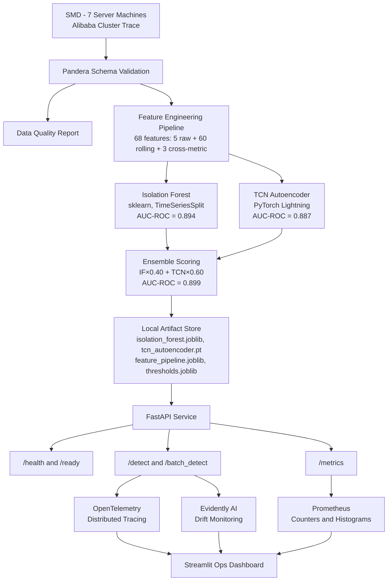

# CloudDrift — Technical Specification
## Version: 1.1 (Post-Sprint Update) | Date: July 2026

---

## 1. Project Overview

**Project name:** CloudDrift — Cloud Infrastructure Anomaly Detector
**GitHub:** https://github.com/howlingwolf77/clouddrift
**Sprint duration:** 14 days
**Owner:** Ryan (howlingwolf77)

CloudDrift detects cloud infrastructure anomalies using an ensemble of Isolation Forest
(statistical) and a TCN Autoencoder (deep learning) trained on real production server
telemetry from the Server Machine Dataset (SMD) with supplementary feature engineering
from the Alibaba Cluster Trace 2018.

The system provides a REST API for real-time anomaly scoring with lightweight z-score
feature attribution, a Streamlit ops dashboard, Prometheus metrics, and OpenTelemetry
distributed tracing.

---

## 2. Problem Statement

Traditional cloud monitoring tools are reactive: they alert after a threshold has been
breached. CloudDrift detects the subtle, multi-metric drift signatures that precede
threshold violations — giving ops teams a window to intervene proactively.

**Target user:** Operations engineers and SRE teams monitoring cloud infrastructure

**Primary pain point:** Silent infrastructure drift causing outages or cost spikes

**Value proposition:** Anomaly detection 30–60 minutes before a threshold alert fires

---

## 3. Datasets

| Dataset | Source | Content | License |
|---------|--------|---------|---------|
| Server Machine Dataset (SMD) | github.com/NetManAIOps/OmniAnomaly | 28 server machines, 38-dimensional telemetry, pre-labelled anomalies | MIT |
| Alibaba Cluster Trace 2018 | github.com/alibaba/clusterdata | Production cluster CPU/memory utilization | CC-BY 4.0 |

SMD is the primary training dataset. Alibaba provides supplementary server telemetry
for feature engineering validation and API schema design. Both contain real production
data — not simulated data.

---

## 4. System Architecture

```
[SMD + Alibaba Cluster Trace]
          |
          v
[Pandera Schema Validation] --> [Data Quality Report]
          |
          v
[Feature Engineering Pipeline] (68 features: rolling stats + cross-metric)
          |
          v
[Isolation Forest] + [TCN Autoencoder (PyTorch Lightning)]
          |                         |
          +---[Ensemble Scoring (IF×0.40 + TCN×0.60)]---+
                                    |
                         [Local Artifact Store]
                         artifacts/
                         ├── isolation_forest.joblib
                         ├── tcn_autoencoder.pt
                         ├── feature_pipeline.joblib
                         ├── thresholds.joblib
                         ├── feature_metadata.json
                         ├── ensemble_metadata.json
                         └── reference_stats.json
                                    |
                              [FastAPI Service]
              /health  /ready  /detect  /batch_detect  /metrics
                    |              |              |
             [OpenTelemetry]  [Prometheus]  [Evidently AI]
                    |              |              |
               [Traces]     [/metrics]    [Drift Reports]
                                    |
                         [Streamlit Dashboard]
```



---

## 5. Model Architecture

### 5.1 Isolation Forest

- **Type:** Unsupervised anomaly detection (sklearn)
- **Training data:** SMD normal-behavior rows (235,908 rows, 7 machines)
- **Features:** 68 engineered rolling features per row
- **Validation:** TimeSeriesSplit (5 folds, temporal ordering preserved)
- **Output:** Anomaly score; normalized to [0, 1] for ensemble
- **Threshold calibration:** 90th percentile of validation scores (0.591347)
- **Artifact:** `artifacts/isolation_forest.joblib`

### 5.2 TCN Autoencoder

- **Type:** Deep learning reconstruction-based anomaly detection
- **Framework:** PyTorch Lightning (LightningModule)
- **Training data:** SMD normal-behavior sequences (235,705 sequences, is_anomaly=False)
- **Input shape:** [batch_size, sequence_length=30, input_dim=68]
- **Sequence window:** 30 timesteps × 1 minute = 30-minute look-back
- **Loss function:** MSE reconstruction loss
- **Anomaly signal:** High reconstruction error on anomalous sequences
- **Callbacks:** ModelCheckpoint, EarlyStopping (patience=5), LightningLogger
- **Parameters:** 29,552 total

**TCN Architecture:**
- Encoder: 4 × dilated causal Conv1d blocks (dilation 1, 2, 4, 8), kernel=3
- Channels per level: [68→32→32→16→8]
- Residual connections throughout
- Bottleneck → mirrored decoder [8→16→32→32→68]

**Contingency Ladder (Day 5 decision gate):**

| Rung | Condition | Implementation | Artifact |
|------|-----------|----------------|----------|
| Primary | Days 1-4 on schedule | TCN Autoencoder + Lightning | tcn_autoencoder.pt |
| Fallback A | Day 4 ran long | LSTM Autoencoder + Lightning | lstm_autoencoder.pt |
| Fallback B | Sprint behind | Raw PyTorch LSTM | lstm_autoencoder.pt |

TCN passed the separation check: err_anomaly (0.0074) > err_normal (0.0015).
No fallback was needed.

### 5.3 Ensemble

- IF weight: 0.40 | TCN weight: 0.60 (original design specification)
- Both scores normalized to [0, 1] before combination using training normal bounds
- Severity labels: Critical (>0.8), Warning (0.5–0.8), Normal (<0.5)
- Test AUC-ROC: 0.899 | Test Recall: 0.762 ✓

---

## 6. API Design

**Framework:** FastAPI 0.104+
**Base URL:** http://localhost:8000

| Endpoint | Method | Description |
|----------|--------|-------------|
| /health | GET | Liveness check — is the container running? |
| /ready | GET | Readiness check — are all artifacts loaded? |
| /detect | POST | Single telemetry snapshot → anomaly result |
| /batch_detect | POST | List of telemetry windows → ranked results |
| /metrics | GET | Prometheus scrape endpoint |

### Input schema (/detect)
```json
{
  "cpu_util": 85.3,
  "mem_util": 72.1,
  "net_io_in": 43.04,
  "net_io_out": 33.08,
  "disk_io": 5.0,
  "timestamp": "2026-06-25T14:30:00Z"
}
```

### Output schema (/detect)
```json
{
  "anomaly_score": 0.87,
  "severity_label": "Critical",
  "top_contributing_features": ["cpu_util", "mem_util"],
  "feature_deviation_scores": {
    "cpu_util": 3.42,
    "mem_util": 2.81
  },
  "inference_latency_ms": 4.7,
  "detection_mode": "single_point_zscore"
}
```

---

## 7. Explainability Strategy

**Two-track approach:**

| Track | Location | Method | Purpose |
|-------|----------|--------|---------|
| Lightweight | Production API (/detect) | Z-score deviation ranking | Fast attribution (< 5ms) |
| Full SHAP | Notebook 06 | SHAP TreeExplainer | Portfolio demonstration |

SHAP is intentionally excluded from the API inference path to meet the p95 ≤ 200ms
latency target.

---

## 8. Observability Stack

| Tool | Purpose | Endpoint |
|------|---------|----------|
| OpenTelemetry | Distributed tracing (request + inference spans) | OTLP / stdout |
| Prometheus | Metrics scraping (counters + histograms) | /metrics |
| Evidently AI | Data drift detection vs. training distribution | logs/drift/ |
| Pandera | Schema validation at ingestion and inference time | Inline |

---

## 9. Technology Stack

| Area | Tool | Replaces |
|------|------|---------|
| Linting + Formatting | Ruff | Flake8 + Black |
| Package Management | UV | pip + venv |
| Container Orchestration | Docker Compose v2 | docker-compose v1 |
| Model Validation | TimeSeriesSplit | Single temporal split |
| Data Quality | Pandera | Manual checks |
| Monitoring | Prometheus | Custom log parsing |
| Observability | OpenTelemetry | Ad-hoc time.time() |
| DL Architecture | TCN Autoencoder (primary) | LSTM Autoencoder |
| Training Framework | PyTorch Lightning | Raw PyTorch |

---

## 10. Success Metrics

### Model Performance
| Metric | Target | Achieved |
|--------|--------|---------|
| Isolation Forest Recall | ≥ 65% | 73.3% ✓ |
| Ensemble AUC-ROC | ≥ 0.82 | 0.899 ✓ |
| Autoencoder AUC-ROC | ≥ 0.82 | 0.887 ✓ |
| Error separation (TCN) | anomaly > normal | 0.0074 > 0.0015 ✓ |
| TimeSeriesSplit F1 Std Dev | ≤ 0.05 | 0.001 ✓ |

### Data Quality
| Metric | Target |
|--------|--------|
| Pandera Schema Pass Rate | ≥ 95% |
| Null Rate per Feature | ≤ 5% |
| Timestamp Continuity | Zero gaps > 2× interval |

### System Performance
| Metric | Target |
|--------|--------|
| API Latency /detect (p95) | ≤ 200ms |
| /ready Startup Time | ≤ 10 seconds |
| Docker Compose Build Time | ≤ 3 minutes |
| CI Pipeline Duration | ≤ 5 minutes |

---

## 11. Risk Log

| Risk | Likelihood | Impact | Mitigation |
|------|-----------|--------|------------|
| TCN hyperparameter tuning takes > Day 5 | Medium | High | Contingency ladder: drop to Lightning LSTM |
| SMD/Alibaba data format changes | Low | Medium | Pin dataset commit hash on download |
| Pandera schema too strict | Medium | Low | Start with wide ranges; tighten after profiling |
| OpenTelemetry version conflicts | Low | Medium | Pin OTel packages to tested versions |
| WSL2 memory constraints with large datasets | Medium | High | Use machine subset; scale horizontally |

---

## 12. Sprint Timeline

| Day | Phase | Primary Task | Deliverable |
|-----|-------|-------------|-------------|
| 1 | Setup | Repo, UV, structure, spec | Repo live on GitHub; spec v1 |
| 2 | 1A | SMD + Alibaba ingestion; Pandera validation | Validated datasets; quality report |
| 3 | 1B | Feature engineering pipeline (68 features) | Feature matrix; feature_pipeline.joblib |
| 4 | 1C | Isolation Forest + TimeSeriesSplit | Cross-validation report; IF artifact |
| 5 | 1C | TCN Autoencoder (contingency ladder) | Autoencoder artifact |
| 6 | 1D | Ensemble scoring + z-score attribution | Ensemble module; explanation.py |
| 7 | 1D | SHAP notebook | SHAP notebook |
| 8 | 2A | FastAPI endpoints + Pydantic schemas | 5-endpoint API; Swagger UI |
| 9 | 2A | OpenTelemetry + Prometheus integration | observability.py; metrics.py |
| 10 | 2D | Streamlit dashboard + Evidently AI | Dashboard; drift reports |
| 11 | 2B | Docker Compose v2 + deployment | Dockerfile; compose.yml |
| 12 | 2C | GitHub Actions CI/CD pipeline | ci.yml; EC2 deployment |
| 13 | 2E | ADRs + README + documentation | docs/adr/ (6 ADRs); README |
| 14 | Final | Demo recording + submission | Demo GIF; v1.0.0 release |

---

*Spec v1.1 — updated July 2026 following SMD dataset migration.*
*Original spec v1 created Day 1. Dataset changed from NAB to SMD on Day 4 re-run.*
